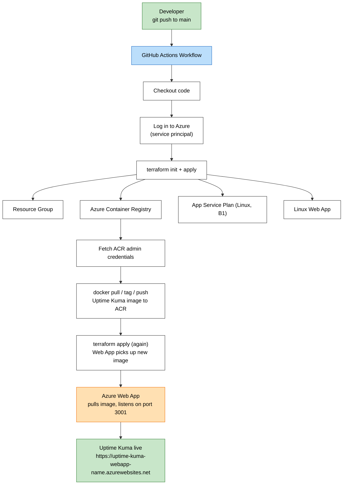

# Uptime Kuma on Azure: Terraform + Docker + GitHub Actions CI/CD

## The Problem

Teams running services they host themselves need a way to know immediately when something goes down, without paying for an external monitoring service or manually checking dashboards. This project deploys Uptime Kuma, an uptime monitoring tool you host yourself, to Azure using infrastructure as code, so the entire environment can be recreated, updated, or torn down in minutes instead of manually reconfigured through a portal.

It also demonstrates a real CI/CD workflow: a single `git push` builds a Docker image, pushes it to a private container registry, and provisions/updates the live Azure infrastructure automatically.

## Architecture



**Stack:** Terraform · Docker · Azure Container Registry · Azure App Service · GitHub Actions · Azure CLI

## Key Decisions

**Why did the pipeline keep failing with "resource already exists," and what does that reveal?**

- My local machine and the GitHub Actions runner each had their own separate, non-persistent Terraform state file, so the runner had no memory of what a previous run had already created in Azure. This caused repeated "resource already exists" errors whenever a partial or manual deploy left resources behind. In production, this is solved with a remote backend (e.g., an Azure Storage account holding the `.tfstate` file) so every environment shares the same state. For this project, I resolved conflicts manually by deleting the resource group between runs, a workable stopgap for a solo learning project but not a scalable practice for a team.

**Why explicit ACR admin credentials on the Web App instead of managed identity?**

- The Web App initially failed to pull its image with an `ImagePullUnauthorizedFailure`, since it had no credentials configured to authenticate against the private registry. I resolved this by passing the ACR's admin username and password directly into the Web App's container settings via Terraform. Azure Managed Identity is the more secure pattern for production, since it stores no credentials on the resource at all, and would be the first thing I'd change if this were a real production service rather than a portfolio project.

**Why did `WEBSITES_PORT` have to be set explicitly?**

- Uptime Kuma listens on port 3001 inside its container, but Azure App Service assumes port 80 by default for incoming traffic. Without `WEBSITES_PORT=3001` set as an app setting, Azure couldn't route external requests to the running application, resulting in a 503 error even though the container itself was technically healthy.

## What I'd Do Differently in Production

- **Remote Terraform state backend** (Azure Storage + state locking) so local and CI runs share one source of truth and never collide
- **Managed Identity** instead of ACR admin credentials, removing stored secrets from the Web App entirely
- **HTTPS Only enforcement** on the Web App (currently allows HTTP)
- **A custom domain** instead of the default `azurewebsites.net` subdomain
- **Separate Terraform workspaces or environments** (dev/staging/prod) rather than a single flat configuration

## How to Deploy This Yourself

### Prerequisites

- An Azure subscription (Azure for Students works fine)
- [Terraform](https://developer.hashicorp.com/terraform/install) installed locally
- [Azure CLI](https://learn.microsoft.com/cli/azure/install-azure-cli) installed and authenticated (`az login`)
- [Docker Desktop](https://www.docker.com/products/docker-desktop/) installed
- A GitHub repository with Actions enabled

### 1. Clone and configure

```bash
git clone <your-repo-url>
cd uptime-kuma-devops
```

Update the resource names in `main.tf` if needed. `azurerm_container_registry.acr.name` must be globally unique across all of Azure.

### 2. Create an Azure Service Principal

This lets GitHub Actions authenticate to Azure on your behalf:

```bash
az ad sp create-for-rbac --name "uptime-kuma-github-actions" \
  --role contributor \
  --scopes /subscriptions/<your-subscription-id> \
  --sdk-auth
```

### 3. Add GitHub Secrets

In your repo: **Settings → Secrets and variables → Actions**, add:

- `AZURE_CREDENTIALS`, the full JSON output from step 2

### 4. Push to trigger the pipeline

```bash
git add .
git commit -m "Deploy Uptime Kuma to Azure"
git push origin main
```

GitHub Actions will provision the infrastructure, build and push the Docker image, and deploy the app automatically. Watch progress under the **Actions** tab.

### 5. Access the app

Once the pipeline finishes, visit:

```
https://<your-webapp-name>.azurewebsites.net
```

### 6. Tear down

To avoid ongoing charges:

```bash
az group delete --name uptime-kuma-rg --yes
```

## Screenshots

| Step | Screenshot |
| --- | --- |
| `main.tf`, the full Terraform configuration | `screenshots/02-main-tf-vscode.png` |
| GitHub repo with Terraform + workflow files | `screenshots/03-github-repo-files.png` |
| GitHub Secrets configured | `screenshots/04-github-secrets.png` |
| GitHub Actions, full pipeline run, all steps passing | `screenshots/05-github-actions-success.png` |
| Uptime Kuma setup page, live on Azure | `screenshots/06-uptime-kuma-setup-azure.png` |
| Uptime Kuma dashboard, live on Azure | `screenshots/07-uptime-kuma-dashboard-azure.png` |
| Azure Portal, all provisioned resources | `screenshots/08-azure-resources.png` |
